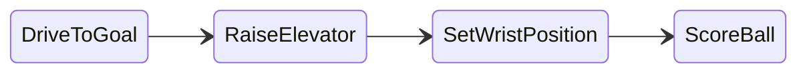
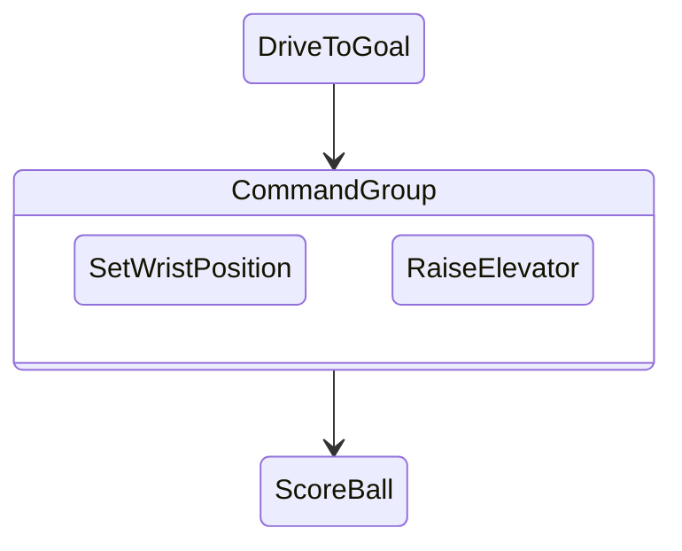
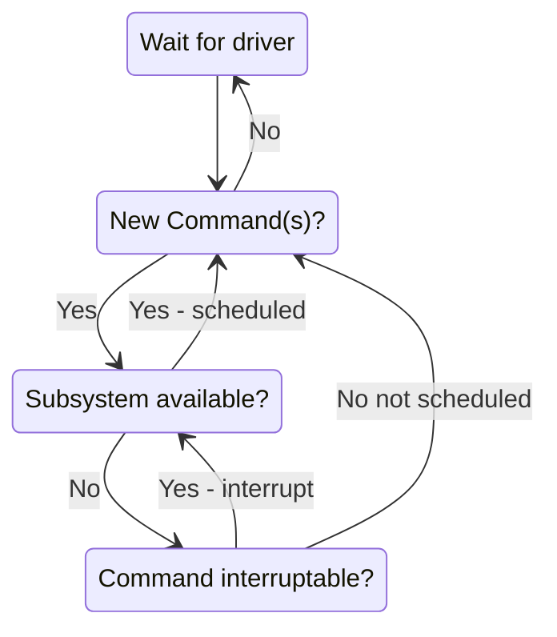
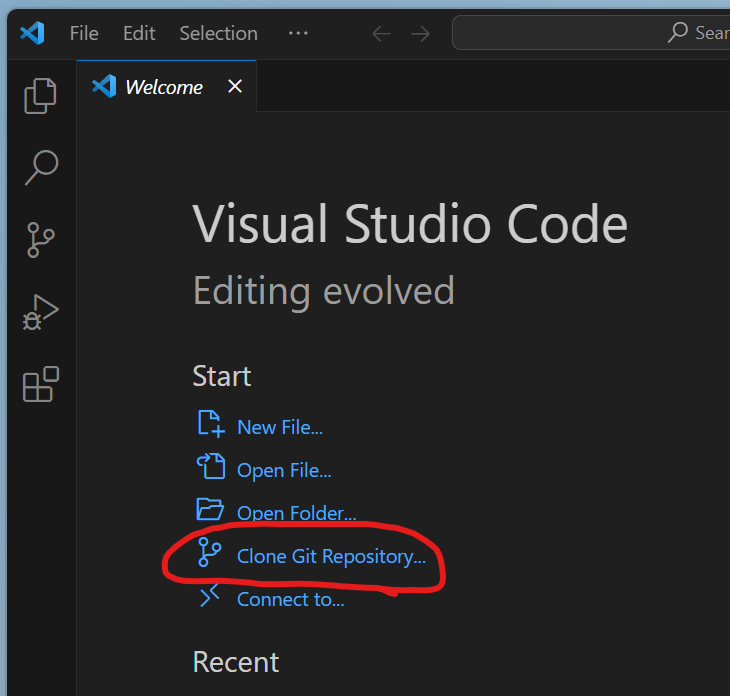
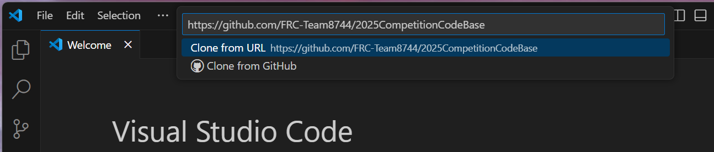

# Setting up for the new season!
* Select a laptop.  This will be your computer for the season.  Use masking tape to put your name on it.  Take care of it.
* If you like using a mouse, claim one and keep it with your laptop when you put it away after meetings.
* Put your laptop on a charger after every meeting!

Do not save any code to the Desktop!  It will quickly become difficult to organize and find what you need.

> Each laptop has a folder in the directory called C:\Users\\[PabloComputer].
> Create a folder named “FRC2026” and save all your code there.
>
> [What's a directory?](https://www.geeksforgeeks.org/ethical-hacking/windows-file-system-structure/)

## Github lessons
* Lessons for the season will be uploaded to: [https://github.com/FRC-Team8744/FRC_2026_SoftwareLessons](https://github.com/FRC-Team8744/FRC_2026_SoftwareLessons)

## Software checklist to setup or update
* Update the operating system!
* FRC Game Tools (Driver Station, Shuffleboard, roboRio & radio imager): [https://docs.wpilib.org/en/stable/docs/zero-to-robot/step-2/frc-game-tools.html](https://docs.wpilib.org/en/stable/docs/zero-to-robot/step-2/frc-game-tools.html)
* WPILib VSCode: [https://docs.wpilib.org/en/stable/docs/zero-to-robot/step-2/wpilib-setup.html](https://docs.wpilib.org/en/stable/docs/zero-to-robot/step-2/wpilib-setup.html)
* Set up a Github account for yourself.

## Visual Studio Shortcuts
* `Ctrl+Shift+P` brings up the command palette. (or click the red hexagon with the W)
* All First Robotics commands will start with `WPILib:`
* `F5` simulates the code (or runs a Romi)
* `Ctrl+F5` loads the code into a RoboRio (the competition robot)

## Documentation
https://docs.wpilib.org

This is your best resource.  Remember it!
(Make sure you are reading the most up to date version)
We will be using Java to program the robots to keep things simple.  If you see a code example, sometimes you have to switch it to a Java view.

## FRC Robot Code Structure (Command-Based Java)
All the robot base code is built from a set of libraries maintained by WPI (Worcester Polytechnic Institute).  The library handles the many small details of getting your robot to work with your team and allowing many teams to run robots together in a competition.

[Example code structure](https://github.com/FRC-Team8744/2025CompetitionCodeBase/tree/main/src/main/java/frc/robot)

* **Main.java** - DON'T CHANGE ANYTHING IN IT! :)  All this file does is start up an object called Robot.
* **Robot.java** - This is responsible for the program’s control flow and should be mostly empty.  Notice how the names of the methods declared (autonomous, teleop, test) match the operations in the FRC Driver Station.  Two important points: the CommandScheduler.getInstance().run() call in the robotPeriodic() method is essential, and the teleopInit() method cancels any still-running autonomous commands.  Only advanced programmers should modify this file.
* **RobotContainer.java** - Use this to define the basic capabilities of your robot - what the RoboRio is connected to and how to use those resources.  This is where you will bind commands to triggering events (such as buttons), and specify which command you will run in your autonomous routine.
* **Constants.java** - Non-changing robot values (such as speeds, unit conversion factors, PID gains, and sensor/motor port numbers) are stored here.
* **Subsystems** - These files encapsulate parts of the robot into easy to use software objects.  For instance, "Drivetrain" is usually used for moving the robot base around.  In your code, you just send the object a throttle and turning speed.
* **Commands** - These files make it easy to group together sequences of robot actions.  For instance, driving up to the scoring station on the playing field and throwing in a ball.

## Why do we need all this complexity?
* Robot actions happen over time (raise the arm, move to a new spot), so act/wait looping is always there
* Multiple actions need to occur at once (raise the arm, open the gripper, move forward)
* If something is not working correctly, it is easy to isolate one action
* Robot behavior needs to be changed quickly at competition

## How commands work

Commands let you break up the tasks of operating the robot into small chunks. Each command has an execute() method that does some work and an isFinished() method that tells if it is done. This happens on every update from the driver station or about every 20ms. Commands can be grouped together and executed sequentially, starting the next one in the group as the previous one finishes.

## Concurrency

Sometimes it is desirable to have several operations happening concurrently. In the previous example you might want to set the wrist position while the elevator is moving up. In this case, a command group can start a parallel command (or command group) running.

## How it works - Scheduling commands

There are three main ways commands are scheduled:
* Manually, by calling the start() method on the command (used for autonomous)
* Automatically by the scheduler based on button/trigger actions specified in the code (typically defined in the OI class but checked by the Scheduler).
* Automatically when a previous command completes (default commands and command groups).
Each time the driver station gets new data, the periodic method of your robot program is called. It runs a Scheduler that checks the trigger conditions to see if any commands need to be scheduled or canceled.

When a command is scheduled, the Scheduler checks to make sure that no other commands are using the same subsystems that the new command requires. If one or more of the subsystems is currently in use, and the current command is interruptible, it will be interrupted and the new command will be scheduled. If the current command is not interruptible, the new command will fail to be scheduled.

## How It Works - Running Commands
After checking for new commands, the scheduler proceeds through the list of active commands and calls the execute() and isFinished() methods on each command. Notice that the apparent concurrent execution is done without the use of threads or tasks which would add complexity to the program. Each command simply has some code to execute (execute method) to move it further along towards its goal and a method (isFinished) that determines if the command has reached the goal. The execute and isFinished methods are just called repeatedly.

## Command Groups
More complex commands can be built up from simpler commands. For example, shooting a disc may be a long sequence of commands that are executed one after another. Maybe some of these commands in the sequence can be executed concurrently. Command groups are commands, but instead of having an isFinished and execute method, they have a list of other commands to execute. This allows more complex operations to be built up out of simpler operations, a basic principle in programming. Each of the individual smaller commands can be easily tested first, then the group can be tested.

## Overview of GitHub in VSCode
[Overview video](https://www.youtube.com/watch?v=i_23KUAEtUM) <!-- 7 min -->

If you want to learn more:
* [Git in VSCode Documentation](https://code.visualstudio.com/docs/sourcecontrol/overview)

## Quick Start
1. We will go through the exercise of downloading last season's competition code from GitHub and programming it into the robot.
2. Open VSCode.  If the "Welcome" page doesn't show up, select `File` -> `New Window`
3. Click on "Clone Git repository"

4. Enter the URL of our competition code

5. The URL is: https://github.com/FRC-Team8744/2025CompetitionCodeBase
6. Put the code in your FRC2025 folder.
7. Have a look at the code (yes, it's a mess!)
8. Take turns downloading the program to the robot. Verify it works. You will need a joystick!

### Further reading:
* [Zero to Robot](https://docs.wpilib.org/en/stable/docs/zero-to-robot/introduction.html)
* [VS Code Overview](https://docs.wpilib.org/en/stable/docs/software/vscode-overview/index.html)
* [Basic Programming](https://docs.wpilib.org/en/stable/docs/software/basic-programming/index.html)
* [Getting Started with Romi](https://docs.wpilib.org/en/stable/docs/romi-robot/index.html)
* [Command-based programming](https://docs.wpilib.org/en/stable/docs/software/commandbased/index.html)
* [Inroduction to FRC software development (old, but still very useful)](https://youtu.be/64hPDvphcfA)
