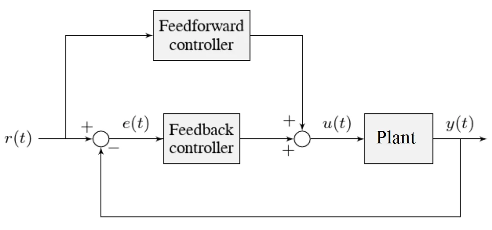

# Lesson 4: Servo control using PID

## Introduction to electronic control systems
Have you ever wondered how your home thermostat keeps the temperature comfortable?  How does a remote controlled car know what direction to steer?  These are generally called control systems - you set a goal for the system, and it tries to hold that goal.  How?

When we first get our robot to move with a human driver, we are using "open-loop" control.  This means that we are not verifying that the robot is doing exactly what we asked of it.  If the robot doesn't hit the correct speed, the human driver recognizes this and pushes the joystick harder.  Thus, the human is correcting the motion of the robot.

Does this work for autonomous driving of the robot?  We can create routines that simply apply power for a fixed amount of time to make the robot move forward a certain distance or to turn the robot a specific direction.  What can go wrong with this approach?

To get our robot to perform tasks reliably, we need to use control systems.  The simplest system is like your home thermostat.  Sometimes this is called "bang-bang" control because it is simply ON or OFF.  The heater in your home is only turned on when the temperature in the house is too low.  Once it is warm enough, the heater is turned off.  When the home starts to cool down again, the cycle repeats.

### We will demonstrate this kind of control using a simulation: [Bang Bang Control](https://docs.wpilib.org/en/stable/docs/software/advanced-controls/introduction/tuning-flywheel.html#bang-bang-control)

* Change the setpoint to 100, so the simulation will run. Watch how power is applied only to cross the setpoint threshold.
* Change the setpoint to 300 or higher, does this type of control work well?
* Change the setpoint to 20, how much error do you see in the rotor velocity?

### Let's see what happens if we run the same system under open loop control: [Open Loop Control](https://docs.wpilib.org/en/stable/docs/software/advanced-controls/introduction/tuning-flywheel.html#pure-feedforward-control)

* Change kV to 0.1. The power applied doesn't change - what setpoint error does this cause?
* Reduce kV until the steady state output approaches the setpoint.
* Without a human making adjustments, does this control strategy work well?

Notice the terminology change in the simulator: "Feedforward" control.  A robot cannot see what is happening and correct for it, like a human can.  But we can measure the motor speed (after a while) with a given input.  This way we can predict an output speed that is "close enough" if there are no disturbances to the system.

As we saw from the simulations, a carefully selected open loop control value will reach the desired setpoint - but it takes a long time.  With simple threshold control, you will reach the desired speed quickly, but with lots of variation in that speed.

How do we achieve a middle ground between fast settling and low output jitter?

## Proportional Control
The next step is called "proportional" control.  Instead of turning full motor power on and off, we apply motor power based on the amount of setpoint error.  As the system gets closer to the goal, the power applied to the motor decreases.  This way we get faster settling time, and not so much overshoot of the goal.

Here we will introduce the graphical representation of our control system: [Basic Control Diagram](https://docs.wpilib.org/en/stable/docs/software/advanced-controls/introduction/control-system-basics.html#nomenclature)

[Image Link: Basic Control Diagram](https://docs.wpilib.org/en/stable/_images/control-system-basics-feedbackplant.webp "WPILib Control System Basics")

### Definition of terms
* reference (setpoint) - the goal your system is trying to reach
* gain - how much amplification is added to the corrective force, like a volume setting
* plant - as in "industrial plant", the mechanism to be controlled
* output - measurement of the actual controlled variable
* error = (reference - measured output)
* closed-loop: Any ideas?

**Side Note:** why negative feedback?

### Control Response
When talking about the performance of a controller, you will hear several common terms:

[Image link: Response Types](https://docs.wpilib.org/en/stable/_images/introduction-to-pid-damped-controller.webp "PID responses")

* Unstable - the output looks like a sine wave and never settles to the setpoint
* Underdamped - the output overshoots the setpoint and has a decaying oscillation
* Overdamped - the output reacts too slowly
* Critically damped - the output reaches the setpoint as fast as possible without crossing the setpoint (no direction reversal)

### Simulating proportional control (PID)  

Let's try to simulate pure PID: [Pure Feedback Control](https://docs.wpilib.org/en/stable/docs/software/advanced-controls/introduction/tuning-flywheel.html#pure-feedback-control)

* Follow the tuning procedure listed directly after the simulation.  How did it go?

It is important to point out that PID control makes a few assumptions:
1. The entire mathematical system is LINEAR. (more on this later)
2. No effort is required to keep the system at the setpoint.

Ignoring the first for now, is there an issue with using only PID control?  (Think back to bang-bang control)

Because of the type of system under control (force required to keep on the setpoint), it is best to combine PID with feedforward control.  Give it a try: [Putting it all together](https://docs.wpilib.org/en/stable/docs/software/advanced-controls/introduction/tuning-flywheel.html#combined-feedforward-and-feedback-control)

### PID + FF System Diagram
Now that you have a better feel for the system dynamics, we can discuss a more accurate system diagram:

[Image link: System Diagram](https://docs.wpilib.org/en/stable/_images/control-system-basics-ctrl-plus-plant.webp "System Diagram")

## Real world PID tuning exercise
We are going to use Phoenix Tuner X to learn how to tune velocity and position control loops for a drive motor in a swerve module.  Hint: how did you tune the velocity controller for the flywheel?

* [Docs for Phoenix Tuner](https://v6.docs.ctr-electronics.com/en/stable/docs/tuner/index.html)
* [How to control devices with Tuner](https://v6.docs.ctr-electronics.com/en/stable/docs/tuner/controlling-devices.html)
* [Plotting the motor sensors](https://v6.docs.ctr-electronics.com/en/stable/docs/tuner/plotting.html)
* For position control, review [Tuning a turret position](https://docs.wpilib.org/en/stable/docs/software/advanced-controls/introduction/tuning-turret.html)

### Independent Learning
Read chapters 1 & 2 in [Controls engineering in FRC](https://file.tavsys.net/control/controls-engineering-in-frc.pdf).  Beyond those chapters it gets pretty heavy into the math.

Long, but a very good video overview: [Motion Planning and Control in FRC](https://www.youtube.com/watch?v=8319J1BEHwM)

