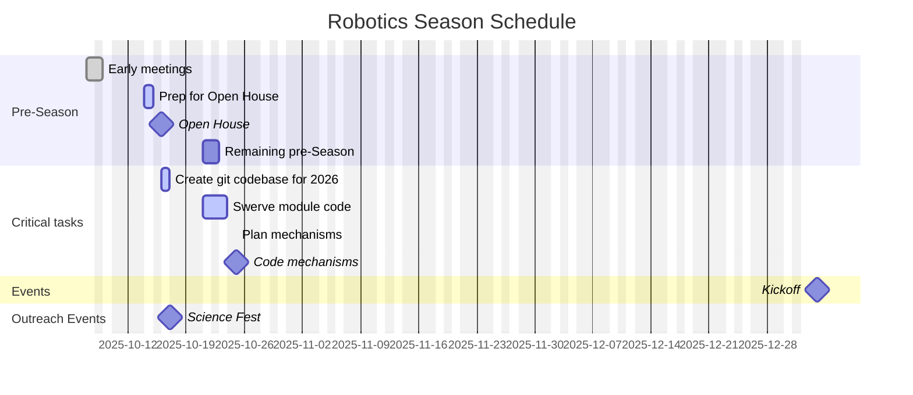
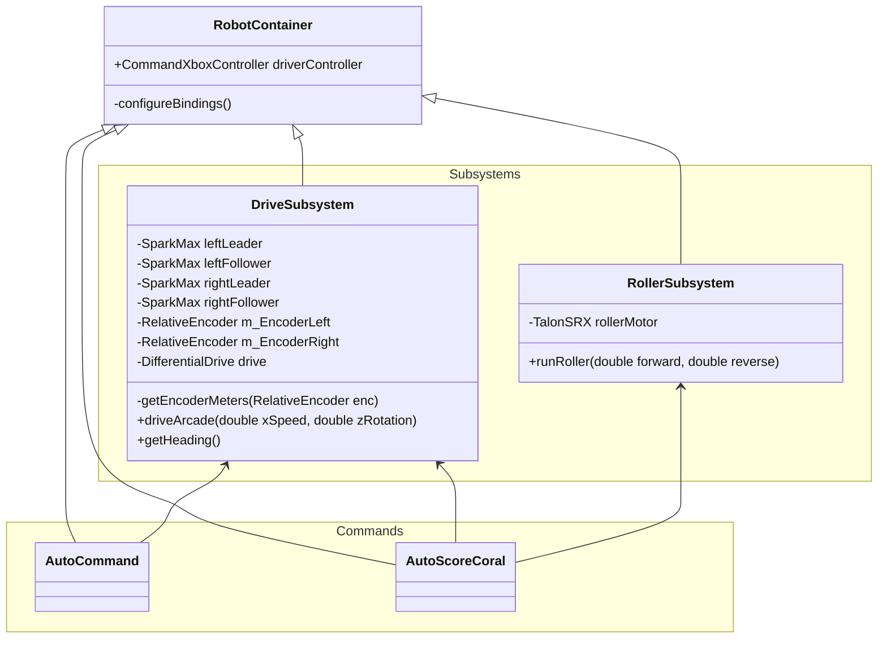

# FRC_2026_SoftwareLessons

This is just an outline of the season lessons for now.  It will eventually be removed.

Requirements for Test code:
* open loop speed control for motors
* Turn to degree mode for motors
* Encoder feedback
* Turn to position mode
* Safe operating speeds
* Operates all motors in our inventory (individually)
* diagnostic data: voltage, current, motor capacity, battery internal resistance estimate, temperature

Electrical/programming kit for competition:
* checklist for robot cart
    * Ethernet cable spool & patch cable
    * Long USB-C cable for motor driver programming (orange)
    * USB-C to Ethernet dongle for laptop
* checklist for pit
* checklist for software team cart
    * video presentation cable (long HDMI cable with FRC logo)

Season updates / inventory
* Verify operation of all joysticks

Java coding
* Basic Structure / syntax
* Data types
* Simple code/print
* VS Code / Git
* conditional/loops
* comments/ readable/code review

WPILib coding
* Basic structure
* Motor structure
* controller programming
* motor programming
    * vendor software for motor drivers
* mechanisms
* competition know-how: direct ethernet connection to robot, radio programming, battery hygene

Test of a season schedule chart:

Test Class Diagram
